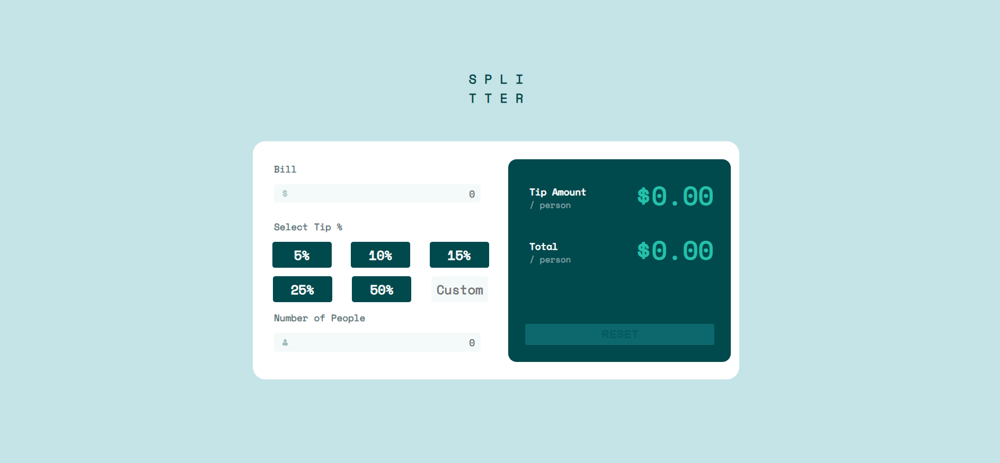
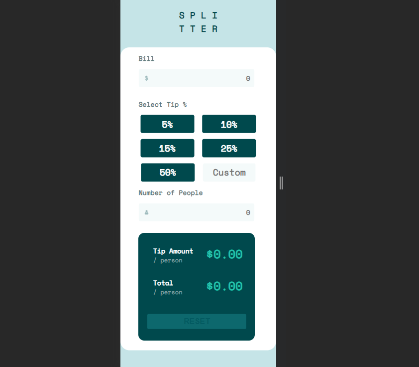

# Frontend Mentor - Tip calculator app solution

This is a solution to the [Tip calculator app challenge on Frontend Mentor](https://www.frontendmentor.io/challenges/tip-calculator-app-ugJNGbJUX). Frontend Mentor challenges help you improve your coding skills by building realistic projects.

## Table of contents

- [Overview](#overview)
  - [The challenge](#the-challenge)
  - [Screenshot](#screenshot)
  - [Links](#links)
- [My process](#my-process)
  - [Built with](#built-with)
  - [What I learned](#what-i-learned)
  - [Continued development](#continued-development)
  - [Useful resources](#useful-resources)
- [Author](#author)
- [Acknowledgments](#acknowledgments)

**Note: Delete this note and update the table of contents based on what sections you keep.**

## Overview

This project was made with the idea of putting in practice concepts like Flex-wrap, event listeners and variable scopes. I felt less difficulty designing the interface of this project thanks to previous solutions I made in recent days.

### The challenge

Users should be able to:

- View the optimal layout for the app depending on their device's screen size
- See hover states for all interactive elements on the page
- Calculate the correct tip and total cost of the bill per person

### Screenshot

### Links

- Solution URL: [Solution URL](https://www.frontendmentor.io/solutions/tip-calculator-made-with-vainilla-html-css-and-js-v8mha0QkwK)
- Live Site URL: [Live Site URL](https://javila26.github.io/tipcalculator-app/)

## My process

### Built with

- Semantic HTML5 markup
- CSS custom properties
- Flexbox
- Javascript

### What I learned

Since I've been using Flexbox for my previous solutions I thought it was a good opportunity to take it to the next level and implement some flex-wrap for the responsiveness of the layout. Besides from that I put to work some other Javascript concepts like variables scope and event listeners.

### Continued development

This is my third Frontend Mentor challenge which helps me setting up my new streak of submitting a new solution for a challenge every week.

### Useful resources

- [MDN](https://developer.mozilla.org/es/) - It's always useful having an official source of truth. This website helps to be up to date with new changes made for Javascript and CSS tools
- [W3Schools CSS](https://www.w3schools.com/css/) - Having always a bit code to mess with and make sure of understanding a property comes very handy.

## Author

- Website - [Jose Ávila](https://github.com/javila26)
- Frontend Mentor - [@javila26](https://www.frontendmentor.io/profile/javila26)

## Acknowledgments

Thanks to my friends who helped me testing this website in their phones and computers.
